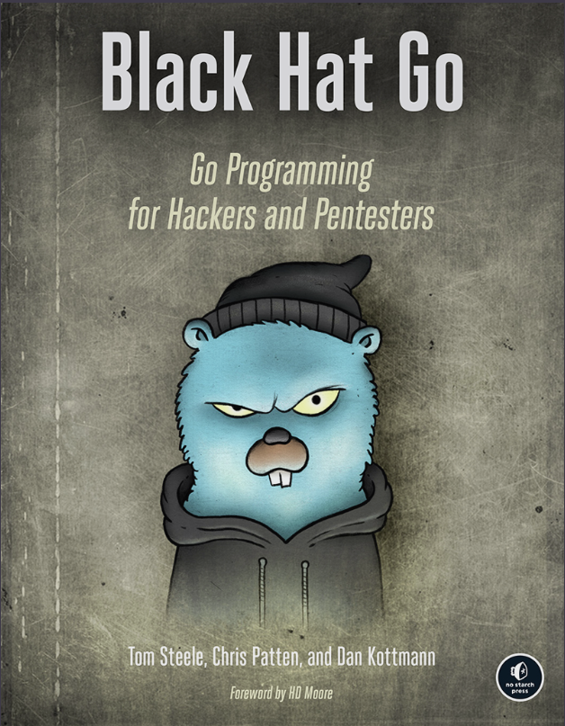

<h1 align="center">Black-Hat-Go</h1>

    

---

# 💻 About the project

    - Chapter 1: Go Fundamentals
    The goal of this chapter is to introduce the fundamentals of the Go programming language and provide a foundation necessary for understanding the concepts within this book. This includes an abridged review of basic Go syntax and idioms. We discuss the Go ecosystem, including supporting tools, IDEs, dependency management, and more. Readers new to the programming language can expect to learn the bare necessities of Go, which will allow them to, hopefully, comprehend, implement, and extend the examples in later chapters.

    - Chapter 2: TCP, Scanners, and Proxies
    This chapter introduces basic Go concepts and concurrency primitives and patterns, input/output (I/O), and the use of interfaces through practical TCP applications. We’ll first walk you through creating a simple TCP port scanner that scans a list of ports using parsed command line options. This will highlight the simplicity of Go code compared to other languages and will develop your understanding of basic types, user input, and error handling. Next, we’ll discuss how to improve the efficiency and speed of this port scanner by introducing concurrent functions. We’ll then introduce I/O by building a TCP proxy—a port forwarder—starting with basic examples and refining our code to create a more reliable solution. Lastly, we’ll re-create Netcat’s “gaping security hole” feature in Go, teaching you how to run operating system commands while manipulating stdin and stdout and redirecting them over TCP.

    - Chapter 3: HTTP Clients and Remote Interaction with Tools
    HTTP clients are a critical component to interacting with modern web server architectures. This chapter shows you how to create the HTTP clients necessary to perform a variety of common web interactions. You’ll handle a variety of formats to interact with Shodan and Metasploit. We’ll also demonstrate how to work with search engines, using them to scrape and parse document metadata so as to extract information useful for organizational profiling activities.

    - Chapter 4: HTTP Servers, Routing, and Middleware
    This chapter introduces the concepts and conventions necessary for creating an HTTP server. We’ll discuss common routing, middleware, and templating patterns, leveraging this knowledge to create a credential harvester and keylogger. Lastly, we’ll demonstrate how to multiplex command-and-control (C2) connections by building a reverse HTTP proxy.

    - Chapter 5: Exploiting DNS
    This chapter introduces you to basic DNS concepts using Go. First, we’ll perform client operations, including how to look for particular domain records. Then we’ll show you how to write a custom DNS server and DNS proxy, both of which are useful for C2 operations.

    - Chapter 6: Interacting with SMB and NTLM
    We’ll explore the SMB and NTLM protocols, using them as a basis for a discussion of protocol implementations in Go. Using a partial implementation of the SMB protocol, we’ll discuss the marshaling and unmarshaling of data, the usage of custom field tags, and more. We’ll discuss and demonstrate how to use this implementation to retrieve the SMB-signing policy, as well as perform password-guessing attacks.

    - Chapter 7: Abusing Databases and Filesystems
    Pillaging data is a critical aspect of adversarial testing. Data lives in numerous resources, including databases and filesystems. This chapter introduces basic ways to connect to and interact with databases across a variety of common SQL and NoSQL platforms. You’ll learn the basics of connecting to SQL databases and running queries. We’ll show you how to search databases and tables for sensitive information, a common technique used during post-exploitation. We’ll also show how to walk filesystems and inspect files for sensitive information.

    - Chapter 8: Raw Packet Processing
    We’ll show you how to sniff and process network packets by using the gopacket library, which uses libpcap. You’ll learn how to identify available network devices, use packet filters, and process those packets. We will then develop a port scanner that can scan reliably through various protection mechanisms, including syn-flood and syn-cookies, which cause normal port scans to show excessive false positives.

    - Chapter 9: Writing and Porting Exploit Code
    This chapter focuses almost solely on creating exploits. It begins with creating a fuzzer to discover different types of vulnerabilities. The second half of the chapter discusses how to port existing exploits to Go from other languages. This discussion includes a port of a Java deserialization exploit and the Dirty COW privilege escalation exploit. We conclude the chapter with a discussion on creating and transforming shellcode for use within your Go programs.

    - Chapter 10: Go Plugins and Extendable Tools
    We’ll introduce two separate methods for creating extendable tools. The first method, introduced in Go version 1.8, uses Go’s native plug-in mechanism. We’ll discuss the use cases for this approach and discuss a second approach that leverages Lua to create extensible tools. We’ll demonstrate practical examples showing how to adopt either approach to perform a common security task.

    - Chapter 11: Implementing and Attacking Cryptography
    This chapter covers the fundamental concepts of symmetric and asymmetric cryptography using Go. This information focuses on using and understanding cryptography through the standard Go package. Go is one of the few languages that, instead of using a third-party library for encryption, uses a native implementation within the language. This makes the code easy to navigate, modify, and understand.
    We’ll explore the standard library by examining common use cases and creating tools. The chapter will show you how to perform hashing, message authentication, and encryption. Lastly, we’ll demonstrate how to brute-force decrypt an RC2-encrypted ciphertext.

    - Chapter 12: Windows System Interaction and Analysis
    In our discussion on attacking Windows, we’ll demonstrate methods of interacting with the Windows native API, explore the syscall package in order to perform process injection, and learn how to build a Portable Executable (PE) binary parser. The chapter will conclude with a discussion of calling native C libraries through Go’s C interoperability mechanisms.

    - Chapter 13: Hiding Data with Steganography
    Steganography is the concealment of a message or file within another file. This chapter introduces one variation of steganography: hiding arbitrary data within a PNG image file’s contents. These techniques can be useful for exfiltrating information, creating obfuscated C2 messages, and bypassing detective or preventative controls.

    - Chapter 14: Building a Command-and-Control RAT
    The final chapter discusses practical implementations of command-and-control (C2) implants and servers in Go. We’ll leverage the wisdom and knowledge gained in previous chapters to build a C2 channel. The C2 client/server implementation will, by nature of being custom-made, avoid signature-based security controls and attempt to circumvent heuristics and network-based egress controls.

---

## ⚙️ Activities

    - [ ] Go Fundamentals.
    - [ ] TCP, Scanners, And Proxies.
    - [ ] HTTP Client and Remote Interaction with tools.
    - [ ] HTTP Servers, Routing, and Middleware.
    - [ ] Exploiting DNS.
    - [ ] Interacting with SMB and NTLM.
    - [ ] Abusing databases and Filesystems.
    - [ ] RAW Packet Processing.
    - [ ] Writing and Porting Exploit Code.
    - [ ] Go Plugins and Extendable Tools.
    - [ ] Implementing and Attacking Cryptography.
    - [ ] Windows System Interaction and Analysis.
    - [ ] Hiding Data with Steganography.
    - [ ] Building a Command-And-Control RAT.

---

## 🦸 Author

<a href="#">
    
 

Made by Douglas Souza 👋🏽 Get in touch!

---
## README versions

[English 🇺🇸](./README.md)